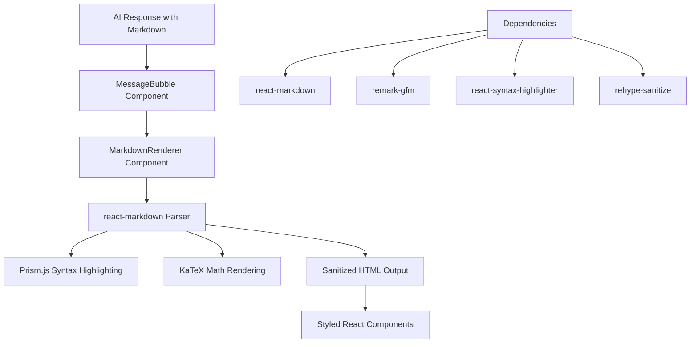

# Study Buddy Markdown Rendering Fix Plan

## Problem Analysis
The Study Buddy chat interface is displaying AI responses in raw `.md` format instead of properly rendered content. The current [`MessageBubble`](src/components/chat/MessageBubble.tsx:131) component uses plain text rendering with `whitespace-pre-wrap break-words` class, but AI responses contain Markdown formatting that needs proper rendering.

## Solution Architecture



## Implementation Strategy

### Phase 1: Dependency Setup
- Install `react-markdown`, `remark-gfm`, `react-syntax-highlighter`, and `rehype-sanitize`
- Configure proper syntax highlighting with existing `prismjs` setup
- Integrate with existing `katex` for math rendering

### Phase 2: Component Development
- Create `MarkdownRenderer` component with security-focused configuration
- Implement proper syntax highlighting for code blocks
- Add math formula rendering support
- Ensure responsive design and accessibility compliance

### Phase 3: Integration & Testing
- Update [`MessageBubble`](src/components/chat/MessageBubble.tsx:131) to use new MarkdownRenderer
- Test with various Markdown formats (lists, tables, code, math)
- Verify streaming response compatibility
- Perform cross-browser testing

## Technical Requirements

### Security Considerations
- XSS prevention through `rehype-sanitize`
- Safe HTML attribute filtering
- Content security policy compliance
- User input validation

### Performance Considerations
- Lazy loading of heavy dependencies
- Efficient re-rendering strategies
- Memory usage optimization for large responses
- Streaming response handling

### Accessibility Requirements
- Proper heading hierarchy
- Alt text for images
- Keyboard navigation support
- Screen reader compatibility

## Dependencies to Add

```json
{
  "react-markdown": "^8.0.0",
  "remark-gfm": "^3.0.0",
  "react-syntax-highlighter": "^15.0.0",
  "rehype-sanitize": "^4.0.0"
}
```

## Component Structure

```
src/components/chat/
├── MarkdownRenderer.tsx          # New: Secure markdown renderer
├── CodeBlock.tsx                 # New: Syntax highlighted code blocks
├── MathBlock.tsx                 # New: KaTeX math rendering
└── MessageBubble.tsx             # Updated: Use MarkdownRenderer
```

## Testing Strategy

### Unit Tests
- Markdown parsing accuracy
- Security sanitization validation
- Component rendering performance
- Error handling scenarios

### Integration Tests
- Full chat flow with Markdown responses
- Streaming response compatibility
- Cross-component interaction
- API response format handling

### User Acceptance Tests
- Visual rendering quality
- Interactive element functionality
- Responsive design verification
- Browser compatibility

## Success Metrics

1. **Functional**: All AI responses display properly formatted content
2. **Security**: No XSS vulnerabilities in Markdown rendering
3. **Performance**: <100ms rendering time for typical responses
4. **Compatibility**: Works across Chrome, Firefox, Safari, Edge
5. **Accessibility**: WCAG 2.1 AA compliance

## Implementation Timeline

- **Day 1**: Dependency setup and basic MarkdownRenderer
- **Day 2**: Security configuration and syntax highlighting
- **Day 3**: Integration with MessageBubble and testing
- **Day 4**: Performance optimization and cross-browser testing
- **Day 5**: Documentation and final validation

## Risk Mitigation

### High Priority Risks
1. **Security vulnerabilities** - Mitigated by using `rehype-sanitize`
2. **Performance degradation** - Mitigated by lazy loading and optimization
3. **Breaking existing functionality** - Mitigated by comprehensive testing

### Medium Priority Risks
1. **Dependency conflicts** - Mitigated by careful version selection
2. **Browser compatibility issues** - Mitigated by cross-browser testing
3. **Accessibility gaps** - Mitigated by accessibility audits

## Rollback Plan

If issues arise:
1. Revert [`MessageBubble`](src/components/chat/MessageBubble.tsx:131) to use plain text rendering
2. Remove new dependencies
3. Restore previous component behavior
4. Maintain functionality while investigating issues

## Validation Checklist

- [ ] Markdown formatting renders correctly
- [ ] Code blocks have syntax highlighting
- [ ] Math formulas display properly
- [ ] Links are safe and functional
- [ ] Images load correctly
- [ ] Tables render properly
- [ ] Lists display with proper formatting
- [ ] Bold/italic text renders correctly
- [ ] Streaming responses work properly
- [ ] No security vulnerabilities
- [ ] Performance meets requirements
- [ ] Cross-browser compatibility verified
- [ ] Accessibility standards met