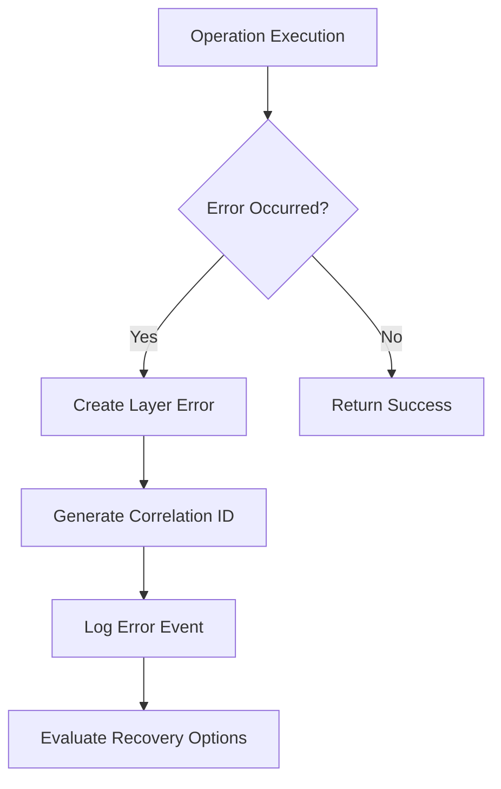
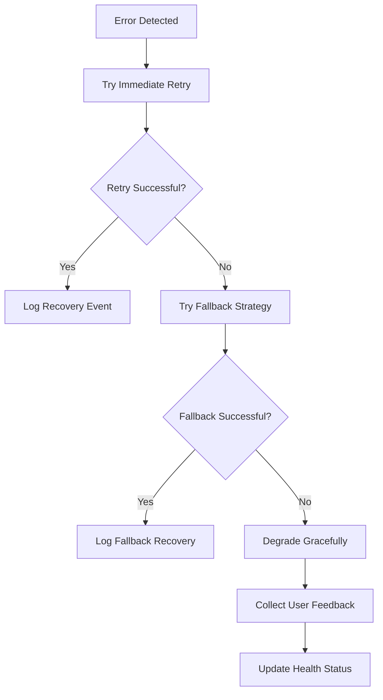
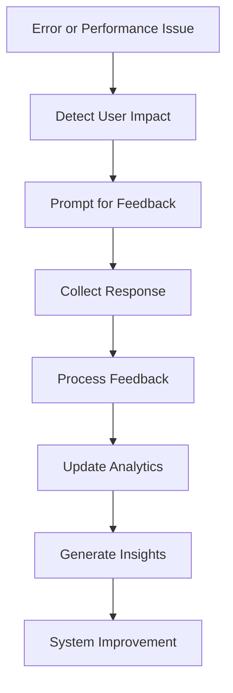

# Comprehensive Error Handling and User Feedback Implementation
# =========================================================

## Executive Summary

This document details the implementation of comprehensive error handling and user feedback systems for the 5-layer hallucination prevention integration. The system provides robust error recovery, user-friendly messaging, system health monitoring, and feedback collection across all layers of the AI response system.

## Architecture Overview

The error handling system is built around 8 core components:

1. **Enhanced Error Handler** (`enhanced-error-handler.ts`)
2. **Error Monitoring System** (`error-monitoring.ts`)
3. **User Feedback System** (`user-feedback-system.ts`)
4. **System Health Monitor** (`system-health-monitor.ts`)
5. **Error Dashboard** (`error-dashboard.tsx`)
6. **Retry Mechanisms** (`retry-mechanisms.ts`)
7. **Test Suite** (`hallucination-prevention-error-handling-test.ts`)
8. **API Endpoints** (Error handling integration)

## Core Components

### 1. Enhanced Error Handler

**File:** `src/lib/hallucination-prevention/error-handling/enhanced-error-handler.ts`

**Purpose:** Provides layer-specific error creation, correlation ID generation, and user-friendly error messages.

**Key Features:**
- Layer-specific error classification (1-5)
- Correlation ID generation for error tracking
- User-friendly vs technical error messages
- Error impact assessment
- Recovery attempt tracking

**Usage Example:**
```typescript
import { createLayerError, createCorrelationId } from './enhanced-error-handler';

// Create a layer-specific error
const error = createLayerError(
  3, // Layer 3
  'Response validation failed', // user-friendly message
  new Error('Fact checking timeout'), // technical error
  { 
    userId: 'user123', 
    sessionId: 'session456',
    conversationId: 'conv789'
  } // context
);

// Generate correlation ID
const correlationId = createCorrelationId('user123', 'session456');
```

### 2. Error Monitoring System

**File:** `src/lib/hallucination-prevention/error-handling/error-monitoring.ts`

**Purpose:** Comprehensive error logging, tracking, and analytics with correlation-based monitoring.

**Key Features:**
- Event-based error logging
- Cascading error detection
- Recovery event tracking
- Error metrics and analytics
- Real-time error correlation

**Usage Example:**
```typescript
import { errorMonitoring } from './error-monitoring';

// Log an error event
errorMonitoring.logEvent({
  type: 'error',
  correlationId: 'corr_1234567890_abcdef',
  layer: 2,
  severity: 'high',
  message: 'Context retrieval timeout',
  sessionId: 'session456',
  conversationId: 'conv789',
  userId: 'user123',
  source: 'server',
  metadata: {
    operation: 'context_retrieval',
    timeout: 5000
  }
});

// Log recovery event
errorMonitoring.logEvent({
  type: 'info',
  correlationId: 'corr_1234567890_abcdef',
  layer: 2,
  severity: 'low',
  message: 'Recovery successful using cached context',
  sessionId: 'session456',
  conversationId: 'conv789',
  userId: 'user123',
  recovery: true,
  recoveryMethod: 'cached_context',
  recoveryTime: 1500,
  source: 'server'
});
```

### 3. User Feedback System

**File:** `src/lib/hallucination-prevention/error-handling/user-feedback-system.ts`

**Purpose:** Collects, processes, and analyzes user feedback for continuous improvement.

**Key Features:**
- Error report submission
- Satisfaction rating collection
- Improvement suggestion system
- Feedback analytics and trends
- Automated feedback analysis

**Usage Example:**
```typescript
import { 
  submitErrorReport,
  submitSatisfactionRating,
  submitImprovementSuggestion 
} from './user-feedback-system';

// Submit error report
const errorReportId = submitErrorReport(
  layerError,
  {
    userId: 'user123',
    sessionId: 'session456',
    conversationId: 'conv789',
    currentPage: '/chat',
    userAgent: navigator.userAgent,
    timestamp: new Date().toISOString(),
    userPreferences: {
      language: 'en',
      timezone: 'UTC',
      accessibility: { screenReader: false, highContrast: false }
    }
  },
  {
    userDescription: 'The AI response seemed incorrect',
    category: 'accuracy',
    severity: 'medium'
  }
);

// Submit satisfaction rating
const feedbackId = submitSatisfactionRating(
  'corr_1234567890_abcdef',
  4, // 1-5 scale
  context,
  'Good performance but could be faster'
);

// Submit improvement suggestion
const suggestionId = submitImprovementSuggestion(
  'Add more detailed explanations',
  context,
  'pedagogy',
  'high'
);
```

### 4. System Health Monitor

**File:** `src/lib/hallucination-prevention/error-handling/system-health-monitor.ts`

**Purpose:** Real-time monitoring of system health across all 5 layers with alerting.

**Key Features:**
- Layer-specific health metrics
- Alert management and escalation
- Health trend analysis
- Automated health checks
- Performance monitoring

**Usage Example:**
```typescript
import { 
  getSystemHealth, 
  getActiveAlerts, 
  systemHealthMonitor 
} from './system-health-monitor';

// Get current system health
const health = getSystemHealth();
console.log(`Overall health: ${health.overall} (${health.score}/100)`);

// Get active alerts
const alerts = getActiveAlerts();
console.log(`Active alerts: ${alerts.length}`);

// Create custom health check
systemHealthMonitor.createHealthCheck(
  'Layer 3 Response Validation',
  async () => {
    // Perform actual health check
    const success = await checkValidationPerformance();
    return {
      status: success ? 'healthy' : 'warning',
      message: success ? 'Validation performing well' : 'Validation slow',
      value: success ? 95 : 80
    };
  },
  {
    interval: 60000, // 1 minute
    threshold: { warning: 85, critical: 70 },
    description: 'Response validation success rate'
  }
);

// Export health report
const report = systemHealthMonitor.exportHealthReport('json');
```

### 5. Error Dashboard

**File:** `src/lib/hallucination-prevention/error-handling/error-dashboard.tsx`

**Purpose:** Real-time monitoring interface for system health, errors, and user feedback.

**Key Features:**
- Real-time system health display
- Error metrics visualization
- Active alert management
- Export capabilities
- Responsive design

**Usage Example:**
```typescript
import { ErrorDashboard } from './error-dashboard';

// Full dashboard component
function AdminPanel() {
  return (
    <ErrorDashboard 
      userId="admin-user"
      refreshInterval={30000} // 30 seconds
    />
  );
}

// Simple dashboard for embedding
function StatusWidget() {
  return <SimpleErrorDashboard />;
}
```

### 6. Retry Mechanisms

**File:** `src/lib/hallucination-prevention/error-handling/retry-mechanisms.ts`

**Purpose:** Intelligent retry logic with exponential backoff and fallback strategies.

**Key Features:**
- Exponential backoff with jitter
- Layer-specific retry strategies
- Fallback mechanism execution
- Circuit breaker pattern
- Recovery success tracking

**Usage Example:**
```typescript
import { 
  executeWithRetry, 
  createRetryContext, 
  DEFAULT_RETRY_CONFIGS 
} from './retry-mechanisms';

// Create retry context
const context = createRetryContext(
  'ai_query',
  3,
  'session123',
  'conv456',
  'user789',
  { operation: 'fact_check' }
);

// Execute with retry
const result = await executeWithRetry(
  async () => {
    // Your operation here
    return await performFactCheck();
  },
  DEFAULT_RETRY_CONFIGS.aiQuery,
  context
);

if (result.success) {
  console.log(`Operation succeeded in ${result.attempts} attempts`);
} else {
  console.log(`Operation failed after ${result.attempts} attempts`);
  console.log(`Final error: ${result.finalError?.message}`);
}
```

## API Integration

### Chat API Enhancement

**File:** `src/app/api/chat/route.ts`

**Enhanced Features:**
- Layer-specific error handling
- Correlation ID generation
- User feedback collection
- Health check integration
- Retry mechanism implementation

**Example Integration:**
```typescript
// Enhanced error handling in chat API
try {
  const result = await executeWithRetry(
    async () => await processChatMessage(message, context),
    DEFAULT_RETRY_CONFIGS.aiQuery,
    retryContext
  );
  
  if (!result.success) {
    // Log to error monitoring
    errorMonitoring.logEvent({
      type: 'error',
      correlationId: retryContext.correlationId,
      layer: 3,
      severity: 'high',
      message: result.finalError?.message || 'Chat processing failed',
      sessionId: sessionId,
      conversationId: conversationId,
      userId: userId,
      source: 'api',
      metadata: { attempts: result.attempts }
    });
    
    // Return user-friendly error
    return NextResponse.json({
      success: false,
      error: {
        code: 'PROCESSING_FAILED',
        message: 'I apologize, but I\'m experiencing technical difficulties. Please try again.',
        correlationId: retryContext.correlationId
      }
    });
  }
} catch (error) {
  // Enhanced error handling with user feedback
  const layerError = handleLayerError(3, error, {
    sessionId,
    conversationId,
    userId
  });
  
  // Collect user feedback automatically
  submitErrorReport(layerError, context, {
    category: 'technical',
    severity: 'high'
  });
}
```

### Suggestions API Enhancement

**File:** `src/app/api/suggestions/route.ts`

**Enhanced Features:**
- Context-aware error recovery
- User feedback integration
- Health monitoring
- Performance tracking

## Error Handling Flow

### 1. Error Detection


### 2. Recovery Process


### 3. User Feedback Collection


## System Health Metrics

### Layer 1: Input Validation
- Input sanitization success rate
- Processing time
- Malformed input rate
- Security violation count

### Layer 2: Context & Memory
- Context retrieval success rate
- Memory usage
- Cache hit rate
- Database connection health

### Layer 3: Response Validation
- Validation accuracy
- Fact-check success rate
- False positive rate
- Processing time

### Layer 4: User Feedback
- Feedback processing rate
- User satisfaction score
- Response rate
- Learning model accuracy

### Layer 5: Quality Assurance
- Quality check success rate
- System response time
- Alert response time
- Overall reliability score

## Alert System

### Alert Severity Levels
1. **Info** - Informational notifications
2. **Warning** - Attention required, non-critical
3. **Error** - Service degradation, needs attention
4. **Critical** - System failure, immediate action required

### Alert Actions
- **Notify** - Send notifications to designated recipients
- **Escalate** - Increase alert priority and notification scope
- **Auto Recover** - Attempt automatic recovery procedures
- **Log** - Record detailed information for analysis
- **Webhook** - Send to external monitoring systems

## Error Metrics and Analytics

### Key Performance Indicators
- **Mean Time to Recovery (MTTR)**
- **Error Rate by Layer**
- **Cascading Error Rate**
- **User Satisfaction Score**
- **Recovery Success Rate**
- **Alert Response Time**

### Reporting
- Real-time dashboards
- Daily/weekly reports
- Trend analysis
- Performance benchmarks
- Capacity planning insights

## User Experience Improvements

### Error Messages
- **Layer-specific messaging** tailored to the failure point
- **Progressive disclosure** - show details only if needed
- **Actionable guidance** - what users can do to help
- **Correlation IDs** for support tickets

### Feedback Collection
- **Invisible collection** - gather insights without interrupting workflow
- **Smart prompting** - ask for feedback when it would be most valuable
- **Multiple channels** - ratings, comments, suggestions
- **Privacy-conscious** - anonymized and aggregated analysis

## Testing and Validation

### Test Coverage
- Unit tests for each component
- Integration tests for layer interactions
- End-to-end scenarios
- Performance testing
- User experience testing

### Test Files
- `src/test/hallucination-prevention-error-handling-test.ts` - Comprehensive test suite
- Individual component test files
- Mock data and fixtures
- Performance benchmarking tests

## Deployment and Monitoring

### Configuration
- Environment-based configuration
- Feature flags for gradual rollout
- Performance thresholds
- Alert escalation rules

### Monitoring
- Real-time health checks
- Performance metrics collection
- User feedback analytics
- System capacity monitoring

## Security Considerations

### Data Protection
- User feedback anonymization
- Secure correlation ID generation
- Data retention policies
- Access control for sensitive data

### Compliance
- GDPR compliance for user data
- Audit trail maintenance
- Secure error reporting
- Privacy-conscious analytics

## Performance Optimization

### Efficiency Measures
- Asynchronous error processing
- Cached health check results
- Optimized correlation tracking
- Minimal memory footprint

### Scalability
- Horizontal scaling support
- Load balancing for error handling
- Distributed monitoring
- Auto-scaling based on error rates

## Future Enhancements

### Planned Features
- Machine learning-based error prediction
- Advanced pattern recognition
- Automated system optimization
- Enhanced user behavior analytics

### Integration Opportunities
- External monitoring systems
- Third-party alerting services
- Business intelligence platforms
- Customer support systems

## Conclusion

The comprehensive error handling and user feedback system provides a robust foundation for maintaining system reliability while continuously improving user experience. The 5-layer architecture ensures that errors are caught and handled at the appropriate level, with sophisticated recovery mechanisms and user-friendly feedback collection.

The system is designed to be:
- **Resilient** - Multiple layers of error handling and recovery
- **Transparent** - Clear communication with users about issues
- **Informative** - Rich analytics and insights for improvement
- **Scalable** - Built to handle growing traffic and complexity
- **Maintainable** - Well-structured and thoroughly tested

This implementation significantly enhances the 5-layer hallucination prevention system, ensuring reliable operation and continuous improvement based on real user feedback and system performance data.